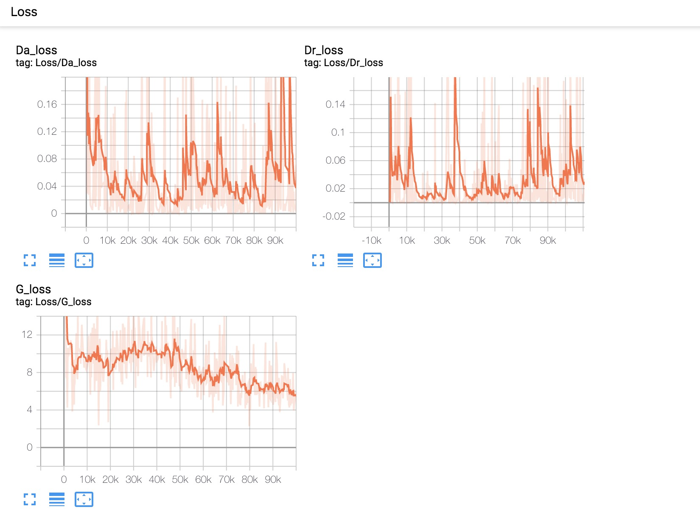
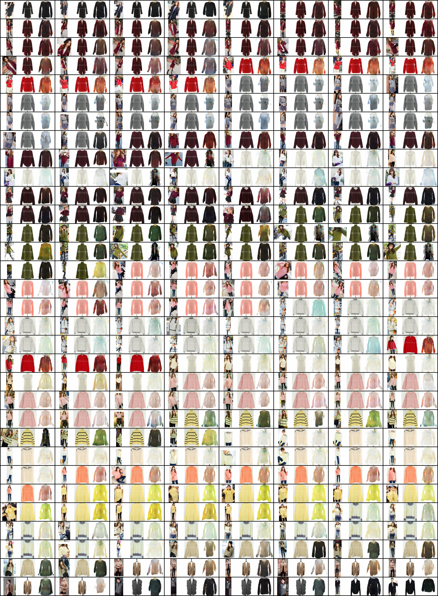

# PixelDTGan-pytorch
This is my personal exercises that reimplement "Pixel-Level Domain Transfer" with Pytorch.

# Below picture shows the training-process on tensorboard:

    
  <em> Loss </em>

    
  <em> generation-gif</em>

    
  <em>validation</em>

## For details

[1] https://blog.csdn.net/hyqwmxsh/article/details/103717306

